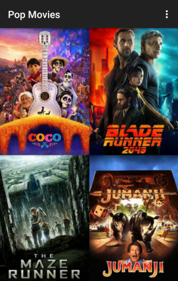
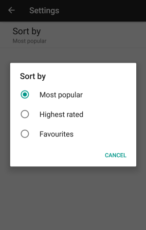
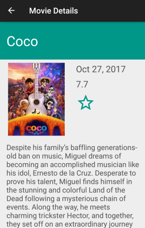

# Popular Movies

Popular Movies is an Android app that allows users to view movie info and save their favourites.

This was created as part of the Android Developer Nanodegree course.

## Project Details

For this project, I was tasked with building an app that allows users to discover the most popular movies playing.

- To present the user with a grid arrangement of movie posters upon launch, I used a RecyclerView with a GridLayoutManager.
- A RecyclerView Adapter was used to populate the list of views.
- Implemented a settings menu with a Preference Fragment to allow users to change sort order of the list.
- Added an Activity for the details screen with additional information about the movie.
- In the details screen, movie trailers are displayed in a list which when clicked on open via Intent either in the YouTube app or browser.
- Implemented a ContentProvider to store data of a user's favourite movies in a SQLite database.

## Getting Started

### Instructions

A valid API key from theMovieDB is needed in order for the app to work.

When you have your API key, open the gradle.properties file and add `API_KEY_VALUE=YOUR_API_KEY`.

## Example Usage

The main screen of the app shows a list of movies. Settings can be accessed in the overflow menu in the app bar.

The settings screen allows the user to sort the movies in the list.

The details screen displays the movie info as well as a star button which saves the movie to the favourites when clicked.

## License

This project is licensed under the MIT License - see the [LICENSE.md](LICENSE.md) file for details.

